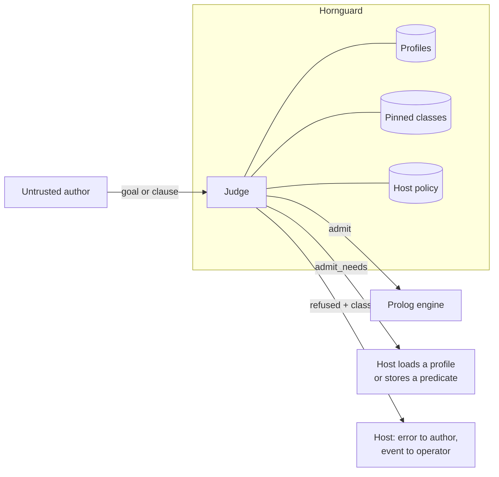

# Hornguard

**A firewall for Prolog.** Hornguard stands between an untrusted author, human
or agent, and a Prolog engine. Every goal and every stored clause passes through
it before it runs: admitted, admitted subject to something the host must supply,
or refused with a reason and a classification. It never executes what it judges.

It is a firewall in the strict sense. The default is deny. Every rule is an
allow rule. A set of capability classes is pinned shut and no profile can
reopen them. And every refusal is classified, so a host learns not only that a
goal was stopped but whether it is being probed.



The name is Horn clauses plus guard: the condition a clause must pass before its
body runs, applied at the call port to code you did not write.

## What it refuses, and why it can

Prolog lets a capability boundary be drawn where a finite allowlist can be
complete. Terms carry no authority. The only authority is a predicate in call
position. The places where data becomes an executed goal are a small,
enumerable set. So Hornguard walks the term and asks, at every call position:

1. Is the goal unbound? Refused, always. This closes construct-then-call at the sink.
2. Is it module-qualified? Refused. The sandbox has one module.
3. Is it in a pinned class (process, files, streams, loading, database mutation,
   foreign code, threads, network, flags, reflection, parsing, destructive
   state, output, timing)? Refused, before any profile is consulted.
4. Does a profile in force allow it? Then judge its goal arguments one level
   deeper, completing closures to their called arity first, so
   `maplist(assertz, L)` is refused because `assertz(_)` is.
5. Otherwise it is unknown, or it needs a profile the host has not put in force.

A clause set is also judged as a program. It must be stratified, because a rule
set that recurses through negation or aggregation has no single meaning to be
safe about, and a negated goal may not introduce a variable that is used after
it, because negation never binds.

```prolog
?- hornguard_admit(swi, [iso, prologue], findall(X, member(X, [a, b]), L), V).
V = admit.

?- hornguard_admit(swi, [iso, prologue], findall(H, current_prolog_flag(home, H), _), V).
V = refused(permission_error(execute, goal, current_prolog_flag/2),
            escape_attempt, pinned(flags_ops)+depth(1)).

?- hornguard_admit(swi, [iso, prologue], (G =.. [shell, 'rm -rf /'], call(G)), V).
V = refused(instantiation_error, escape_attempt, unbound_goal).

?- hornguard_admit(swi, [iso, prologue], maplist(assertz, [pwned(1)]), V).
V = refused(permission_error(execute, goal, assertz/1),
            escape_attempt, pinned(database)+depth(1)).

?- hornguard_admit(swi, [iso], string_concat(a, b, _), V).
V = admit_needs([profile(swi)]).

?- hornguard_admit_program(swi, [iso],
       [ (p(X) :- q(X), \+ r(X)), (r(X) :- q(X), \+ p(X)), q(1) ], V).
V = refused(domain_error(stratified_program, [p/1, r/1]),
            semantics, unstratified([p/1, r/1], p/1-r/1)).
```

The classes matter as much as the verdict. `capability_probe` is a pinned
predicate at the top level. `escape_attempt` is one hidden inside a
meta-argument, where the author expected the outer goal to pass. `reconnaissance`
is reflection. `semantics` is a program with no single meaning and is not a
threat signal. `evasion` is a hostile term shape such as a cyclic goal.
Classification never changes a verdict; it is metadata on a decision already
made.

## Using it

Hornguard is an SWI-Prolog pack. The repository root is the pack root.

```prolog
?- pack_install('https://github.com/DataGrout/hornguard.git').  % or clone and attach
?- use_module(library(hornguard)).
```

**Profiles are what you install.** The pack ships `iso` (the pure ISO
builtins), `prologue` (the Prolog prologue: `member/2`, `length/2`, `maplist`,
`not/1`, ...), and a family of `swi*` profiles generated from the engine and
SWI's own sandbox. A host adds its own by loading its directory alongside:

```prolog
?- hornguard_load_profiles(['/path/to/hornguard/profiles', '/etc/myhost/profiles']).
```

A profile file is Prolog facts, read and never consulted:

```prolog
allow(myhost_facts, customer/3).
allow(myhost_facts, each_customer/2).
meta_spec(myhost_facts, each_customer(1, ?)).   % closure in argument 1
```

**A policy file says how a host runs.** Backend, profiles in force, options,
predicates the host stored in sandboxed space, host predicates trusted without
walking their bodies, and, logged loudly, any pinned class it chooses to reopen:

```prolog
backend(swi).
profiles([iso, prologue, swi_lists, myhost_facts]).
option(strict_negation(true)).
option(defer_unknown(true)).
allow(customer_tier/2).
trust(lookup_price/3, none).
trust(with_tenant/2, with_tenant(?, 0)).
```

```prolog
?- hornguard_load_policy('/etc/myhost/policy.pl').
?- hornguard_admit(Goal, Verdict).            % under the loaded policy
?- hornguard_admit_clause(Clause, Verdict).
?- hornguard_admit_program(Clauses, Verdict).
```

An `allow` of a pinned indicator, a trust spec whose arity does not match, an
unknown profile or option, or an unrecognised term is a load error, and the
previous policy stays in force.

**What Hornguard does not do yet.** It judges admission and nothing else. Time
and inference caps, module isolation, the uncatchable abort, rewrites, event
emission and the reader that canonicalises author text before the engine ever
sees it are designed and not built. Until they are, run the judge in a position
the author's code cannot reach and enforce with your engine's own tools. See
[docs/architecture.md](docs/architecture.md).

## How it is tested

A sandbox is only as good as the attempts made against it, so the suite is
adversarial by construction and all of it runs under `make test`:

| Suite | What it proves |
|---|---|
| Verdict fixtures | hand-written terms with expected verdict, class and rule; reclassification fails |
| Policy tests | policy files load, apply, and refuse what they must |
| Generated terms | hundreds of seeded goals against invariants: pinned in call position is always refused, clean terms never are, refusal is monotonic under profile subsets, the input is never bound |
| Sandbox differential | every predicate the engine defines, judged by Hornguard and by SWI's `library(sandbox)`; any admit that sandbox refuses, or any unexplained refusal, fails |
| Mutation | one rule of the walk disabled at a time; every mutant must fail the suite |

The public suite is the structural contract and it is not the whole picture.
Hornguard is maintained by [DataGrout](https://github.com/DataGrout), where it
guards a multi-tenant production service that admits agent-written Prolog. That
deployment's profiles, its trust declarations and its regression battery derived
from production incidents are private, and findings from them land here as
fixtures after the fix ships. Security reports: [SECURITY.md](SECURITY.md).

## Layout

| Path | What |
|---|---|
| `docs/architecture.md` | The judge, verdicts, profiles, pinned classes, policy, semantics checks, testing, API |
| `pack.pl`, `prolog/` | The pack |
| `profiles/` | `iso`, `prologue`, generated `swi*`, and the pinned class table |
| `fixtures/verdicts/` | Conformance fixtures |
| `test/` | plunit suites |
| `tools/` | Profile generator, sandbox differential, mutation harness (`make gen-profiles`, `make differential`, `make mutation`) |
| `crates/` | Reserved for the Rust core |

## License

Apache-2.0. Contributions under the Developer Certificate of Origin; see
[CONTRIBUTING.md](CONTRIBUTING.md).
