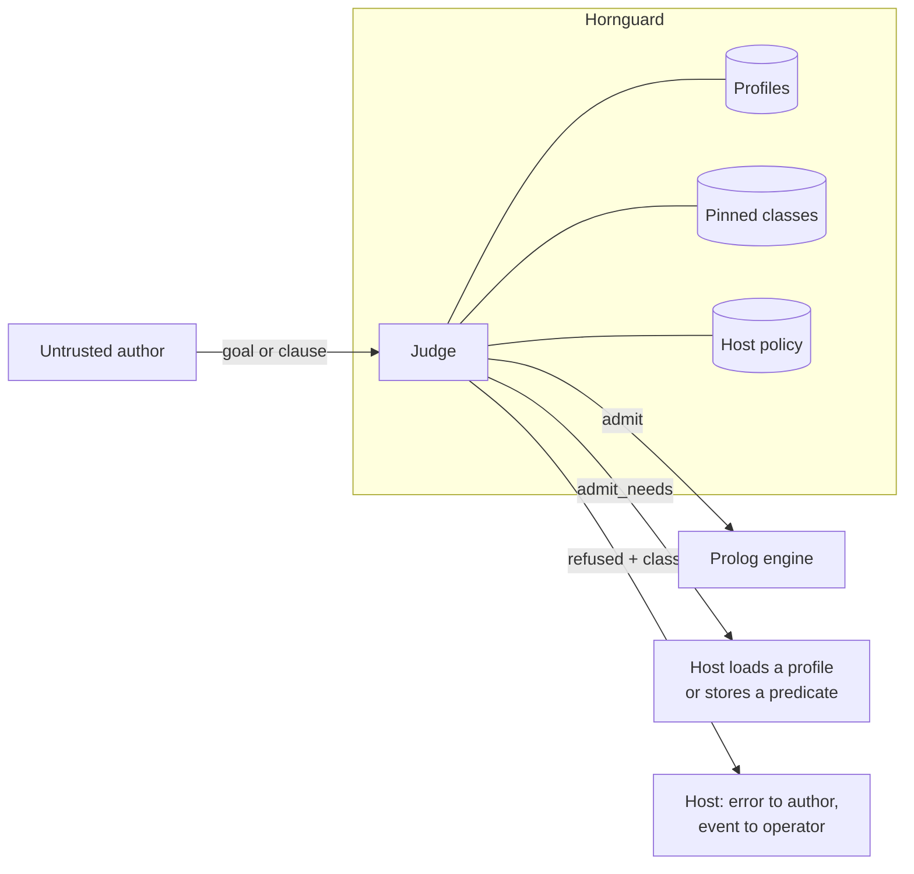

# Hornguard

**A firewall for Prolog.** Hornguard stands between an untrusted author and a
Prolog engine. The author it was built for is an AI agent writing rules and
queries into a shared engine: an agent that may be mistaken, may be following
injected instructions it took for its user's, or may be operated by someone
whose goal is the engine itself. Every goal and every stored clause passes
through Hornguard before it runs: admitted, admitted subject to something the
host must supply, or refused with a reason and a classification. It never
executes what it judges.

It is a firewall in the strict sense. The default is deny. Every rule is an
allow rule. A set of capability classes is pinned shut and no profile can
reopen them. And every refusal is classified, so a host learns not only that a
goal was stopped but whether it is being probed.



The name is Horn clauses plus guard: the condition a clause must pass before its
body runs, applied at the call port to code you did not write.

> **0.1.0 judges admission and nothing else.** Caps, isolation, an abort the
> author's `catch/3` cannot swallow, rewrites and event emission are designed
> and not built. Run the judge where an author's code cannot reach it — the
> worker does that — and enforce with your engine's own tools. See
> [Beyond the judge](#beyond-the-judge).

## What it refuses, and why it can

Prolog lets a capability boundary be drawn where a finite allowlist can be
complete. Terms carry no authority. The only authority is a predicate in call
position. The places where data becomes an executed goal are a small,
enumerable set. So Hornguard walks the term and asks, at every call position:

1. Is the goal unbound? Refused, always. This closes construct-then-call at the sink.
2. Is it module-qualified? Refused. The sandbox has one module.
3. Is it in a pinned class (process, files, streams, loading, database mutation,
   foreign code, threads, network, flags, reflection, parsing, destructive
   state, output, timing, deferred execution, shared engine state)? Refused,
   before any profile is consulted.
4. Does a profile in force allow it? Then judge its goal arguments one level
   deeper, completing closures to their called arity first, so
   `maplist(assertz, L)` is refused because `assertz(_)` is.
5. Otherwise it is unknown, or it needs a profile the host has not put in force.

Two places the walk looks where a reader might not expect it to. Arithmetic is a
second language inside the first, so the expressions of `is/2` and the
comparisons are checked for the evaluables that read the clock: `X is cputime`
is refused as `timing`, the way `sleep/1` is. And a stored clause may not
define anything the judge reasons about: a control construct, a pinned or
profile predicate, or a predicate the host trusts, since the trusted definition
is the one whose body is never walked.

A clause set is also judged as a program. It must be stratified, because a rule
set that recurses through negation or aggregation has no single meaning to be
safe about, and a negated goal may not introduce a variable that is used after
it, because negation never binds.

```prolog
?- hornguard_admit(swi, [iso, prologue], findall(X, member(X, [a, b]), L), V).
V = admit.

?- hornguard_admit(swi, [iso, prologue], findall(H, current_prolog_flag(home, H), _), V).
V = refused(permission_error(execute, goal, current_prolog_flag/2),
            escape_attempt, pinned(flags_ops)+depth(1)).

?- hornguard_admit(swi, [iso, prologue], (G =.. [shell, 'rm -rf /'], call(G)), V).
V = refused(instantiation_error, escape_attempt, unbound_goal).

?- hornguard_admit(swi, [iso, prologue], maplist(assertz, [pwned(1)]), V).
V = refused(permission_error(execute, goal, assertz/1),
            escape_attempt, pinned(database)+depth(1)).

?- hornguard_admit(swi, [iso], string_concat(a, b, _), V).
V = admit_needs([profile(swi)]).

?- hornguard_admit_program(swi, [iso],
       [ (p(X) :- q(X), \+ r(X)), (r(X) :- q(X), \+ p(X)), q(1) ], V).
V = refused(domain_error(stratified_program, [p/1, r/1]),
            semantics, unstratified([p/1, r/1], p/1-r/1)).
```

The classes matter as much as the verdict, and they matter most when the
author is an agent. A model that has been told to fetch a file will try
`open/3`, then `read_term/2` inside a `findall`, then build the goal from
atoms and `call` it, each attempt shaped by the last refusal. To the host every
one of those is a stopped goal; to an operator the sequence is the difference
between a confused agent and an operated one. `capability_probe` is a pinned
predicate at the top level. `escape_attempt` is one hidden inside a
meta-argument, where the author expected the outer goal to pass. `reconnaissance`
is reflection. `semantics` is a program with no single meaning and is not a
threat signal. `evasion` is a hostile term shape such as a cyclic goal.
Classification never changes a verdict; it is metadata on a decision already
made.

## Dynamic dispatch, judged at the sink

Rule 1 refuses every unbound goal in call position, which closes
construct-then-call completely and also rules out every meta-interpreter, generic
rule engine and `maplist(call, Goals)` an author might legitimately write. The
sanctioned relaxation is `dynamic_dispatch(judged)`. Under it the judge does not
refuse an unbound goal or closure; it rewrites it to a call the judge sees again
at the moment it runs, and the verdict is `admit_with(Guarded)`:

```prolog
?- hornguard_admit(swi, [iso, prologue], (member(G, Gs), call(G), maplist(P, Xs)),
                   [dynamic_dispatch(judged)], V).
V = admit_with((member(G, Gs), hornguard_call(G), maplist(hornguard_call(P), Xs))).
```

`hornguard_call/N` judges its goal under the loaded policy, plus whatever the
host set with `hornguard_set_runtime_context/1` for the namespace whose rules
are running, and only then calls it. A refusal is thrown as
`error(Reason, hornguard(Class, runtime(Rule)))`, and `catch/3` in a guarded
term becomes `hornguard_catch/3`, which cannot swallow it, a time limit, or a
resource error. Bound goals are still judged statically, at their depth, with
their classification; the runtime judge only takes what the static one could
not see. Nothing runs unjudged in either mode, and a host that wants the runtime
judgment made in a process the author cannot reach defines
`hornguard:runtime_judge_hook/2`. Run `Guarded`, never the original: the
worker's `canonical` under this mode is the guarded term.

## Batteries and other installed code

A host that installs a library of rules into an author's space, DataGrout's
batteries for instance, has two questions: does the library itself pass, and
may authors call it. Judge the library's clauses as a program with its own
profile named in `defining/1`, so its heads are the definitions the profile
promises rather than shadows of it, and give that profile `allow` and
`meta_spec` entries for what the library exports. Authors then call the library
through a profile like any other, closures included. A library that meta-calls
its arguments or reads clauses is exactly the case judged dispatch exists for;
judge it under `dynamic_dispatch(judged)` and install the guarded form. If the
library defines operators, declare them with `op/3` terms in the profiles
directory: the worker's reader honours them, and the canonical form it emits is
operator-free, so the engine never needs to. `op/3` itself stays pinned for
authors.

## Using it

Hornguard is an SWI-Prolog pack. The repository root is the pack root.

```prolog
?- pack_install('https://github.com/DataGrout/hornguard.git').  % or clone and attach
?- use_module(library(hornguard)).
```

**Profiles are what you install.** The pack ships `iso` (the pure ISO
builtins), `prologue` (the Prolog prologue: `member/2`, `length/2`, `maplist`,
`not/1`, ...), and a family of `swi*` profiles generated from the engine and
SWI's own sandbox. A host adds its own by loading its directory alongside:

```prolog
?- hornguard_load_profiles(['/path/to/hornguard/profiles', '/etc/myhost/profiles']).
```

A profile file is Prolog facts, read and never consulted:

```prolog
allow(myhost_facts, customer/3).
allow(myhost_facts, each_customer/2).
meta_spec(myhost_facts, each_customer(1, ?)).   % closure in argument 1
```

**A policy file says how a host runs.** Backend, profiles in force, options,
predicates the host stored in sandboxed space, host predicates trusted without
walking their bodies, and, logged loudly, any pinned class it chooses to reopen:

```prolog
backend(swi).
profiles([iso, prologue, swi_lists, myhost_facts]).
option(strict_negation(true)).
option(defer_unknown(true)).
allow(customer_tier/2).
trust(lookup_price/3, none).
trust(with_tenant/2, with_tenant(?, 0)).
```

```prolog
?- hornguard_load_policy('/etc/myhost/policy.pl').
?- hornguard_admit(Goal, Verdict).            % under the loaded policy
?- hornguard_admit_clause(Clause, Verdict).
?- hornguard_admit_program(Clauses, Verdict).
```

An `allow` of a pinned indicator, a trust spec whose arity does not match, an
unknown profile or option, or an unrecognised term is a load error, and the
previous policy stays in force.

**From Rust.** The [`hornguard` crate](crates/hornguard) is a thin client of
the worker: it spawns the process, checks the protocol version, and gives you
a typed verdict.

```rust
let mut hg = Hornguard::builder().profiles(["iso", "prologue"]).spawn()?;
match hg.judge_goal("findall(X, member(X, [a, b]), L)")? {
    Verdict::Admit { canonical } | Verdict::AdmitWith { canonical } => run(&canonical),
    Verdict::AdmitNeeds { needs, .. } => ...,      // never the author's text, above
    Verdict::Refused { class, rule, .. } => ...,
}
```

**From any language.** The judge worker runs the pack in its own process and
speaks one JSON object per line over stdin and stdout. It reads author text
under the backend's reader flags, refuses reader-level hazards, and hands back
admitted terms in canonical form with the author's variable names intact, so
the engine never parses author text:

```
$ make worker
{"hello":"hornguard","protocol":1,"engine":"swi","version":"9.2.9","profiles":[...]}
{"id":1,"op":"judge_goal","text":"findall(X, member(X,[a,b]), L)","profiles":["iso","prologue"]}
{"id":1,"verdict":"admit","canonical":"findall(X,member(X,[a,b]),L)"}
```

**What Hornguard does not do yet.** It judges admission and nothing else. Time
and inference caps, module isolation, the uncatchable abort, rewrites and event
emission are designed and not built. Until they are, run the judge in a position
the author's code cannot reach (the worker) and enforce with your engine's own
tools. See [docs/architecture.md](docs/architecture.md).

## Beyond the judge

Admission is one layer of a safe Prolog host, and the cheapest. A deployment
that lets untrusted authors store and run rules also needs:

- **Isolation.** One author's clauses, global state and tables must be
  unreachable from another's, which in practice means a worker per tenant and a
  discipline for what survives a restart.
- **Enforcement.** Time, inference and stack caps on every call, and an abort
  the author's own `catch/3` cannot swallow.
- **Governed re-entry.** A proof that needs live data mid-inference has to reach
  the outside world through the same policy, accounting and audit path as any
  other action, and resume with the result bound.
- **Receipts.** A record of what was admitted, under which profiles, by which
  version of which attestations, so a judgment can be audited after the fact.
  The verdict is designed to be recorded: it is a term, the canonical text it
  was given for is a fixed point, and the profiles and pinned table are data
  with a version. A host that certifies its rules can hash those four things
  into the certificate and later prove not only that a rule ran but that this
  judge, under these profiles, admitted it. DataGrout does this in the
  certificate it mints for a stored rule.
- **Attestation.** Every profile entry is a claim that a predicate is pure on a
  given engine version. Profiles are cheap to write; keeping the claims true as
  engines change is the expensive part, and it only happens where the library
  meets real traffic.

Hornguard was extracted in September 2026 from the sandbox guarding
[DataGrout](https://github.com/DataGrout)'s production Logic Cells, a
multi-tenant service where agents write and run Prolog. DataGrout's platform
implements the layers above on top of this judge: certified admission with
signed receipts, per-tenant isolation, governed tool calls from inside a proof,
and content screening for what the rules are fed. Its profiles, trust
declarations and incident-derived regression battery are private; findings from
them land here as fixtures once the fix has shipped. The library is the seam.
What a host builds above it is the host's business.

## How it is tested

A boundary is only as good as the attempts made against it, so the suite is
adversarial by construction and all of it runs under `make test`:

| Suite | What it proves |
|---|---|
| Verdict fixtures | hand-written terms with expected verdict, class and rule; reclassification fails |
| Policy tests | policy files load, apply, and refuse what they must |
| Generated terms | hundreds of seeded goals against invariants: pinned in call position is always refused, clean terms never are, refusal is monotonic under profile subsets, the input is never bound |
| Sandbox differential | every predicate the engine defines, judged by Hornguard and by SWI's `library(sandbox)`; any admit that sandbox refuses, or any unexplained refusal, fails |
| Mutation | one rule of the walk disabled at a time; every mutant must fail the suite |
| Worker | reader fixtures, and the stdio protocol against a spawned worker, including input that must not kill it |
| Rust client | 20 integration tests, every one against a real worker; no mocks, since a mock would only prove the crate agrees with itself |

The public suite is the contract, and what belongs in it is decided by the
mutation harness rather than by taste: any case needed to kill a mutant is
structural and stays here. A host can run additional fixtures of its own —
cases derived from its own incidents — by naming their directory in
`HORNGUARD_FIXTURES_EXTRA`; they are added to the suite, never subtracted
from it. The maintainer runs 53 such cases against this judge in addition to
everything above. Security reports: [SECURITY.md](SECURITY.md).

## Layout

| Path | What |
|---|---|
| `docs/architecture.md` | The judge, verdicts, profiles, pinned classes, policy, semantics checks, testing, API |
| `pack.pl`, `prolog/` | The pack |
| `profiles/` | `iso`, `prologue`, generated `swi*`, the pinned class table, and `REVIEWS.md`, the record of who attested which generation |
| `fixtures/verdicts/` | Conformance fixtures |
| `test/` | plunit suites |
| `tools/` | Profile generator, sandbox differential, mutation harness (`make gen-profiles`, `make differential`, `make mutation`) |
| `crates/hornguard` | The Rust client: spawns a judge worker and returns typed verdicts |

## License

Apache-2.0. Contributions under the Developer Certificate of Origin; see
[CONTRIBUTING.md](CONTRIBUTING.md).

---

Hornguard is a [DataGrout](https://github.com/DataGrout) project.
