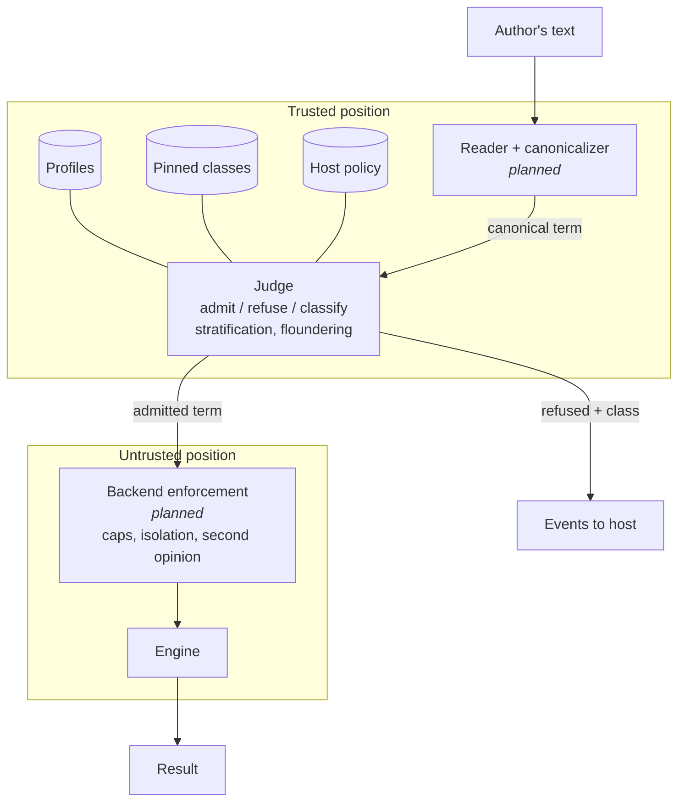
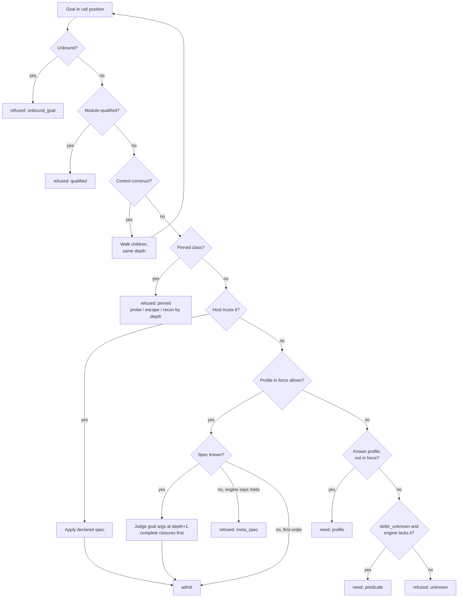
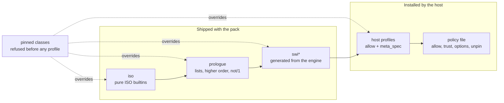

# Hornguard architecture

Hornguard sits between an untrusted author and a Prolog engine. It reads a goal
or a clause set, judges it against allowlist profiles and a pinned set of
capability classes, and either admits it, admits it subject to needs the host
can satisfy, or refuses it with a reason and a classification. It never
executes what it judges.

Every rule is an allow rule. What no profile allows does not run.

## Why the boundary can be complete

Three properties of Prolog make a capability boundary drawable where a finite,
auditable allowlist can be complete rather than merely defensive:

- **Terms are inert.** An atom or compound has no methods, no attributes, and no
  reference to interpreter state. Holding the atom `shell` grants nothing; only
  `shell/1` in a call position does anything, and call positions are visible in
  the term before execution.
- **Dynamic dispatch is finite.** The only route from data to execution is
  `call/N` and the meta-predicates built on it. That set is small and known per
  engine. Refusing any goal that is unbound at judgment time closes goal
  construction at the sink rather than tracking it at every source.
- **Side effects are predicate-shaped and few.** Database mutation, streams,
  loading, flags, operators, process, foreign code, threads. Rules and
  constraints need none of it.

These properties make a correct boundary possible. They do not make any
particular allowlist correct. Every admitted predicate is an attestation of
purity for a specific engine, and every meta-predicate missing from the spec
table is a hole. Hornguard's job is to make those attestations explicit,
per-engine, tested, and hard to weaken by accident.

## Threat model

Trusted: the host process, its operator, and the policy file. Untrusted: every
goal submitted for execution and every clause submitted for storage, whoever
or whatever wrote it. Authors are assumed adversarial and adaptive. Protected:
the host process, platform code loaded in the engine, other tenants sharing a
worker, and the engine's availability.

Out of scope: the content of admitted facts (a fact can carry a prompt
injection and remain an inert term; content screening is a separate layer),
and bugs in the engine's own implementation.

## Layers



The **judge** is pure and portable. It takes a term, a backend identity, and a
set of profiles, and returns a verdict. It is written in ISO Prolog and runs on
any engine, including in its own process as a judge worker serving an engine
of a different kind.

A **backend** is a manifest plus hooks: which predicates exist, their meta
specs, and the enforcement the judge cannot provide (time, inference and stack
caps, isolation, an uncatchable abort). `iso` is the base every backend
inherits, has no enforcement hooks, and refuses to run. `swi` adds engine
introspection today and enforcement later.

The **host bridge** runs the judge in a position the author's code cannot
reach. In-engine judging is supported and documented as weaker.

## The walk

Judgment is a walk over the term, in this order:

1. An unbound goal in call position is refused. Always.
2. A module-qualified goal is refused; the sandbox has one module.
3. The control constructs `,` `;` `->` `*->` and `^` are walked through without
   counting depth.
4. A predicate in a pinned class is refused before any profile is consulted.
5. A predicate the host declared `trust(Indicator, Spec)` is admitted with its
   spec applied and its body not walked.
6. A predicate allowed by a profile in force has each goal argument judged one
   level deeper; closures are completed to full arity with fresh variables
   first. On backends with introspection, an allowed predicate the engine
   declares meta but no profile gives a spec for is refused (fail closed).
7. A predicate allowed only by a profile not in force is recorded as a need;
   under `defer_unknown(true)` so is a predicate the engine does not define.
8. Anything else is refused as unknown, with an existence or permission reason
   depending on what the backend can tell.

The same walk judges clause bodies for storage. A head may not be unbound,
module-qualified, a control construct, or an indicator a pinned class or a
loaded profile already claims. A clause may call its own head. Directives are
refused. A clause set judged as a program has its own heads admitted in bodies.

Before any walk the term is copied without attributes, refused if cyclic, and
the walk's stack exhaustion on a pathological term becomes a refusal rather than
an engine error.



## Verdicts

```
admit
admit_needs(Needs)                Needs: profile(Name) | predicate(Indicator)
refused(Reason, Class, Rule)
```

`Reason` is an ISO error term the host may show the author subject to its own
oracle policy. `Class` is one of:

| Class | Meaning |
|---|---|
| `benign_miss` | unknown predicate, or allowed by a profile not in force |
| `capability_probe` | pinned predicate at the top level |
| `escape_attempt` | pinned predicate inside a meta-argument, unbound goal in call position, module qualification, head shadowing |
| `reconnaissance` | reflection at any depth |
| `semantics` | admissible capability-wise, but no single intended meaning |
| `evasion` | hostile term shape: cyclic, pathologically deep |

`Rule` names what decided: `pinned(Class)`, `unbound_goal`, `qualified`,
`meta_spec(Indicator)`, `unknown`, `not_callable`, `head(Why)`, `directive`,
`unsupported(What)`, `unstratified(Members, Head-Callee)`,
`floundering(NegatedGoal)`, `cyclic_term`, `term_depth`. A pinned rule nested
inside a meta-argument carries `+ depth(N)`: benign code rarely buries a
pinned goal three meta-arguments deep.

Classification never changes a verdict. It is metadata on a decision already
made.

## Profiles

Profiles are the allow rules: named sets of indicators with meta specs in SWI's
`meta_predicate` notation (`0` a goal, `N` a closure taking N more arguments,
`^` an existentially qualified goal, `?` data).

- `iso`: the pure ISO builtins. Hand-written. Deliberately excludes the ISO
  predicates that mutate, do I/O, load, set flags, or reflect.
- `prologue`: the Prolog prologue proposal (`append/3`, `member/2`, `length/2`,
  `between/3`, `maplist`, `foldl`, `not/1`, ...). Hand-written. Real rules
  cannot be written without it.
- `swi`, `swi_lists`, `swi_apply`, `swi_aggregate`, `swi_solution_sequences`,
  `swi_strings`, `swi_pairs`, `swi_ordsets`, `swi_assoc`, `swi_terms`,
  `swi_error`: generated by `tools/gen_swi_profiles.pl` from what the engine
  defines and what SWI's `library(sandbox)` declares safe, minus pinned classes
  and an explicit exclusion table (dicts, lambdas, attributes and DCG deferred;
  timing, reflection and filesystem kept out on purpose). Meta specs derive
  from the engine's declarations. Generation is the starting point of
  attestation, not the end.



Profiles are data, read with `read_term/2`, never consulted. A host loads its
own directory beside the shipped one with `hornguard_load_profiles([Shipped, Mine])`;
the policy check runs over the union, so a host profile cannot reopen a pin.

## Pinned classes

Some capabilities switch the sandbox off. They are refused regardless of
profile, an `allow` naming one is a policy load error, and reopening one takes
an explicit `unpin` that is logged at every load and undone by the next policy:

database, streams, filesystem, loading, process, foreign, threads, network,
flags and operators, reflection, parsing, destructive state, format, timing.

`profiles/pinned.pl` lists the indicators. Name-only pins (`open/_`) are
deliberate here and only here: a single unpinned arity of `open` or `format` is
the whole game.

## Host policy

A policy file is Prolog facts, read and never consulted:

```prolog
backend(swi).
profiles([iso, prologue, swi_lists]).
option(strict_negation(true)).
option(defer_unknown(true)).
allow(customer_tier/2).                  % sandboxed space, body-judged at storage
trust(lookup_price/3, none).             % host-defined, not walked
trust(with_tenant/2, with_tenant(?, 0)). % host meta-predicate, spec required
% unpin(reflection).
```

Two verbs for host predicates: `allow` for predicates whose clauses live in
sandboxed space and were body-judged at storage, `trust` for host predicates
admitted without walking their bodies. `trust` is the only real escape hatch,
so it must declare a meta spec or `none`, and it is the thing a reviewer greps
for. Load errors (an allow of a pinned indicator, a mismatched trust spec, an
unknown profile or option, an unrecognised term) leave the previous policy in
force.

## Semantics checks

Capability is not the only thing a stored program can get wrong.

**Stratification.** Negation as failure computes the right answer only when
the program is stratified. `hornguard_stratification/2` builds the dependency
graph of a clause set, treating `\+`, `not/1`, `forall/2` and the all-solutions
and aggregation predicates as negative dependencies (aggregation is stratified
like negation, as in Datalog), and returns either the strata, lowest first, or
the strongly connected component that recurses through a negative edge and the
edge that closes it. `hornguard_admit_program` requires stratification.

**Floundering.** Negation never binds. `hornguard_floundering/2` reports every
negated goal that introduces a variable (not in the head, not in an earlier
positive goal) which is then used after the negation. A variable occurring only
inside the negation is existential and fine. Aggregation binds only its result
argument. Under `strict_negation(true)`, the default, a finding is refused;
under `false` the host may call the predicate and warn.

The order of judgment is capability, then floundering, then stratification, so
a capability refusal is never masked by a semantics one.

## Testing

Fixtures are the contract every implementation of the judge must satisfy.

- **Verdict fixtures** (`fixtures/verdicts/`): term, profiles, backend, expected
  verdict with class and rule. A change that still refuses a term but
  reclassifies it fails.
- **Policy tests**: policy files load, apply, and refuse what they must.
- **Generated terms**: several hundred seeded goals built from pure, pinned,
  meta and control vocabulary, checked against properties no fixture states
  exhaustively: pinned in call position is always refused, clean terms never
  are, a pinned functor in data position is admitted, refusal is monotonic
  under profile subsets, the input is never bound, verdicts are deterministic,
  backends agree on refusals.
- **Sandbox differential** (`tools/differential.pl`): every predicate the
  engine defines, judged by Hornguard and by SWI's `library(sandbox)`. The test
  fails on any admit that sandbox refuses, on any sandbox-safe predicate
  Hornguard refuses without a pin or exclusion to explain it, and on a
  generated profile that regeneration would change. Running it against the SWI
  development branch is how a changed builtin gets months of notice.
- **Mutation** (`tools/mutate.py`): one rule of the walk disabled at a time in a
  copy of the judge; every mutant must fail the suite.

## API

```prolog
hornguard_admit(+Backend, +Profiles, +Goal, [+Options,] -Verdict)
hornguard_admit_clause(+Backend, +Profiles, +Clause, [+Options,] -Verdict)
hornguard_admit_program(+Backend, +Profiles, +Clauses, [+Options,] -Verdict)
hornguard_stratification(+Clauses, -Result)
hornguard_floundering(+ClauseOrGoal, -NegatedGoals)
hornguard_load_profiles(+DirOrDirs)
hornguard_load_policy(+File)
hornguard_policy(-Policy)
hornguard_admit(+Goal, -Verdict)              % under the loaded policy
hornguard_admit_clause(+Clause, -Verdict)
hornguard_admit_program(+Clauses, -Verdict)
hornguard_profiles(-Names)
```

Options: `allow(Indicators)`, `trust(IndicatorSpecPairs)`,
`strict_negation(Bool)`, `defer_unknown(Bool)`.

## Not yet built

- The judge worker: the pack in its own process, speaking a line protocol,
  reading author text with the target backend's reader flags and emitting
  canonical form so the untrusted engine never parses author text. This is
  the near-term path to trusted-position judging for any host; a Rust core is
  deferred until a host needs the judge in-process (see `crates/README.md`).
- Enforcement: caps, isolation, the uncatchable abort, `library(sandbox)` as an
  in-engine second opinion. `hornguard_run/4` throws `not_implemented`.
- Rewrites (`hornguard_rewrite/3`): the `catch/3` wrapper for backends whose
  abort can be caught, depth guards.
- Events: emission of classified refusals to a host hook, per-session probe
  thresholds, author-facing error detail as a policy setting.
- The `scryer` and `trealla` backends.
