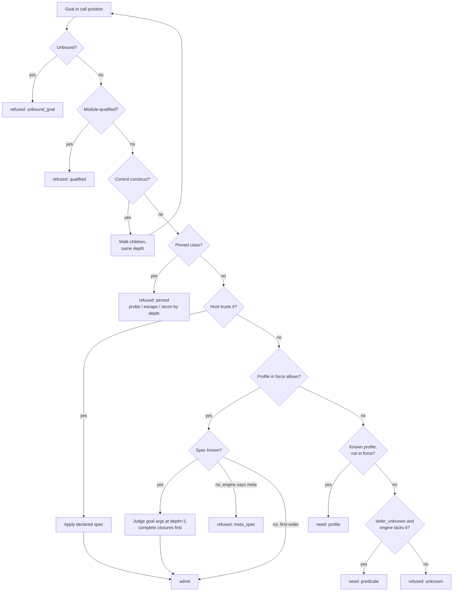
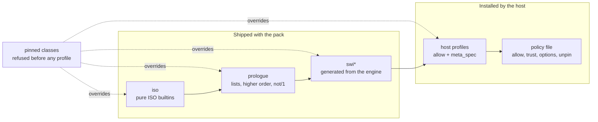

# Hornguard architecture

Hornguard sits between an untrusted author and a Prolog engine. It reads a goal
or a clause set, judges it against allowlist profiles and a pinned set of
capability classes, and either admits it, admits it subject to needs the host
can satisfy, or refuses it with a reason and a classification. It never
executes what it judges.

Every rule is an allow rule. What no profile allows does not run.

## Why the boundary can be complete

Three properties of Prolog make a capability boundary drawable where a finite,
auditable allowlist can be complete rather than merely defensive:

- **Terms are inert.** An atom or compound has no methods, no attributes, and no
  reference to interpreter state. Holding the atom `shell` grants nothing; only
  `shell/1` in a call position does anything, and call positions are visible in
  the term before execution.
- **Dynamic dispatch is finite.** The only route from data to execution is
  `call/N` and the meta-predicates built on it. That set is small and known per
  engine. Refusing any goal that is unbound at judgment time closes goal
  construction at the sink rather than tracking it at every source.
- **Side effects are predicate-shaped and few.** Database mutation, streams,
  loading, flags, operators, process, foreign code, threads. Rules and
  constraints need none of it.

These properties make a correct boundary possible. They do not make any
particular allowlist correct. Every admitted predicate is an attestation of
purity for a specific engine, and every meta-predicate missing from the spec
table is a hole. Hornguard's job is to make those attestations explicit,
per-engine, tested, and hard to weaken by accident.

## Threat model

Trusted: the host process, its operator, and the policy file. Untrusted: every
goal submitted for execution and every clause submitted for storage, whoever
or whatever wrote it. The author Hornguard is designed around is an AI agent
writing Prolog into a multi-tenant engine, and three of its failure modes look
identical at the boundary: an agent that is mistaken about what it may do, an
agent following instructions injected into its context and taken for its
user's, and an agent operated by someone attacking the engine. The judge does
not try to tell them apart in the verdict; it refuses all three the same way
and leaves the telling-apart to the classification and to the host's view of
the sequence. Authors are therefore assumed adversarial and adaptive, because
the second and third are, and the first costs nothing extra to treat that way.
Protected: the host process, platform code loaded in the engine, other tenants
sharing a worker, and the engine's availability.

Out of scope: the content of admitted facts (a fact can carry a prompt
injection and remain an inert term; content screening is a separate layer),
and bugs in the engine's own implementation.

## Layers


The **judge** is pure and portable. It takes a term, a backend identity, and a
set of profiles, and returns a verdict. It is written in ISO Prolog and runs on
any engine, including in its own process as a judge worker serving an engine
of a different kind.

A **backend** is a manifest plus hooks: which predicates exist, their meta
specs, and the enforcement the judge cannot provide (time, inference and stack
caps, isolation, an uncatchable abort). `iso` is the base every backend
inherits, has no enforcement hooks, and refuses to run.

How a backend knows its engine differs, and the difference is load-bearing.
`swi` asks the engine through `predicate_property/2`, which cannot go stale
against the running system and also reports meta declarations, so an allowed
predicate the engine declares meta with no profile spec is refused. `scryer`
and `trealla` cannot be asked from the judge's process, so they carry a
manifest generated by running a probe inside that engine
(`make manifests`). A manifest records existence only: it changes an
unrecognised predicate's refusal from an existence error to a permission
error and stops `defer_unknown` from deferring something the engine really
has. It never widens anything, and it cannot report meta declarations, so on
a manifest-driven backend the profiles' meta specs are the whole story and
must be complete.

A manifest describes the engine **as started**. Libraries widen what exists:
Scryer reaches `shell/1` and sockets through `library(os)` and
`library(sockets)`, which is why `loading` is pinned. A host that loads
libraries into author space has widened the engine and should regenerate the
manifest with them loaded.

Enforcement is declared per backend as `native`, `external`, or `none`, and
`hornguard_run/4` refuses on anything but `native`. Neither Scryer nor
Trealla has in-engine caps the judge's host can rely on, so both are
`external`: the host bounds the engine from outside, with a process wrapper
that caps address space and kills on RSS or on the parent's exit, or with a
WebAssembly runtime's fuel and memory, and attests that before running
anything.

The **host bridge** runs the judge in a position the author's code cannot
reach. In-engine judging is supported and documented as weaker, for two
reasons: the author's code shares a process with the judge, and on SWI the
judge's question "does the engine define this" autoloads the library that
does, so author text decides what the judging process loads. The worker
closes the second by loading every autoloadable library once at start and
switching autoloading off; a host judging in-engine should do the same.

## The walk

Judgment is a walk over the term, in this order:

1. An unbound goal in call position is refused. Always.
2. A module-qualified goal is refused; the sandbox has one module.
3. The control constructs `,` `;` `->` `*->` and `^` are walked through without
   counting depth.
4. A predicate in a pinned class is refused before any profile is consulted.
5. A predicate the host declared `trust(Indicator, Spec)` is admitted with its
   spec applied and its body not walked.
6. A predicate allowed by a profile in force has each goal argument judged one
   level deeper; closures are completed to full arity with fresh variables
   first. On backends with introspection, an allowed predicate the engine
   declares meta but no profile gives a spec for is refused (fail closed).
7. A predicate allowed only by a profile not in force is recorded as a need;
   under `defer_unknown(true)` so is a predicate the engine does not define.
8. Anything else is refused as unknown, with an existence or permission reason
   depending on what the backend can tell.

Arithmetic is a second language inside the first, and the walk looks into it:
the expressions of `is/2` and the comparisons are checked for pinned
evaluables (`pinned_evaluable/2` in `profiles/pinned.pl`, today the two
functions that read the clock), refused with the class and depth a pinned goal
would carry at that position. Everything else in an expression is data.

The same walk judges clause bodies for storage. A head may not be unbound,
module-qualified, a control construct, an indicator a pinned class or a loaded
profile already claims, or a predicate the host trusts: the trusted definition
is the one whose body is never walked, and a clause in sandboxed space with
that head would stand in for it. A clause may call its own head. Directives are
refused. A clause set judged as a program has its own heads admitted in bodies.

Before any walk the term is copied without attributes, refused if cyclic, and
the walk's stack exhaustion on a pathological term becomes a refusal rather than
an engine error.



## Verdicts

```
admit
admit_with(Guarded)               under dynamic_dispatch(judged): run Guarded
admit_needs(Needs)                Needs: profile(Name) | predicate(Indicator)
refused(Reason, Class, Rule)
```

`Reason` is an ISO error term the host may show the author subject to its own
oracle policy. `Class` is one of:

| Class | Meaning |
|---|---|
| `benign_miss` | unknown predicate, or allowed by a profile not in force |
| `capability_probe` | pinned predicate at the top level |
| `escape_attempt` | pinned predicate inside a meta-argument, unbound goal in call position, module qualification, head shadowing |
| `reconnaissance` | reflection at any depth |
| `semantics` | admissible capability-wise, but no single intended meaning |
| `evasion` | hostile term shape: cyclic, pathologically deep |

`Rule` names what decided: `pinned(Class)`, `unbound_goal`, `qualified`,
`meta_spec(Indicator)`, `unknown`, `not_callable`, `head(Why)`, `directive`,
`unsupported(What)`, `unstratified(Members, Head-Callee)`,
`floundering(NegatedGoal)`, `evaluable(Name/Arity)`, `cyclic_term`,
`term_depth`. `head(Why)` is one of `control`, `pinned(Class)`,
`profile(Name)`, `trusted`, `qualified`. A pinned rule nested
inside a meta-argument carries `+ depth(N)`: benign code rarely buries a
pinned goal three meta-arguments deep.

Classification never changes a verdict. It is metadata on a decision already
made.

## Profiles

Profiles are the allow rules: named sets of indicators with meta specs in SWI's
`meta_predicate` notation (`0` a goal, `N` a closure taking N more arguments,
`^` an existentially qualified goal, `?` data).

- `iso`: the pure ISO builtins. Hand-written. Deliberately excludes the ISO
  predicates that mutate, do I/O, load, set flags, or reflect.
- `prologue`: the Prolog prologue proposal (`append/3`, `member/2`, `length/2`,
  `between/3`, `maplist`, `foldl`, `not/1`, ...). Hand-written. Real rules
  cannot be written without it.
- `swi`, `swi_lists`, `swi_apply`, `swi_aggregate`, `swi_solution_sequences`,
  `swi_strings`, `swi_pairs`, `swi_ordsets`, `swi_assoc`, `swi_terms`,
  `swi_error`: generated by `tools/gen_swi_profiles.pl` from what the engine
  defines and what SWI's `library(sandbox)` declares safe, minus pinned classes
  and an explicit exclusion table (dicts, lambdas, attributes and DCG deferred;
  timing, reflection and filesystem kept out on purpose). Meta specs derive
  from the engine's declarations. Generation is the starting point of
  attestation, not the end; who reviewed which generation, against which
  engine, is recorded in `profiles/REVIEWS.md`.



Profiles are data, read with `read_term/2`, never consulted. A host loads its
own directory beside the shipped one with `hornguard_load_profiles([Shipped, Mine])`;
the policy check runs over the union, so a host profile cannot reopen a pin.

## Pinned classes

Some capabilities switch the sandbox off. They are refused regardless of
profile, an `allow` naming one is a policy load error, and reopening one takes
an explicit `unpin` that is logged at every load and undone by the next policy:

database, streams, filesystem, loading, process, foreign, threads, network,
flags and operators, reflection, parsing, destructive state, format, timing,
deferred execution (coroutines: the goal is judged, but it runs later at a
unification the host performs, in the host's code path), shared engine state
(the random seed, the answer tables: what one author sets and another's query
reads).

`profiles/pinned.pl` lists the indicators. Name-only pins (`open/_`) are
deliberate here and only here: a single unpinned arity of `open` or `format` is
the whole game. The same file pins arithmetic evaluables
(`pinned_evaluable/2`): the clock-reading functions, which the walk checks
inside the expressions of `is/2` and the comparisons.

## Host policy

A policy file is Prolog facts, read and never consulted:

```prolog
backend(swi).
profiles([iso, prologue, swi_lists]).
option(strict_negation(true)).
option(defer_unknown(true)).
allow(customer_tier/2).                  % sandboxed space, body-judged at storage
trust(lookup_price/3, none).             % host-defined, not walked
trust(with_tenant/2, with_tenant(?, 0)). % host meta-predicate, spec required
% unpin(reflection).
```

Two verbs for host predicates: `allow` for predicates whose clauses live in
sandboxed space and were body-judged at storage, `trust` for host predicates
admitted without walking their bodies. `trust` is the only real escape hatch,
so it must declare a meta spec or `none`, and it is the thing a reviewer greps
for. Load errors (an allow of a pinned indicator, a mismatched trust spec, an
unknown profile, option or pinned class, an unrecognised term) leave the
previous policy and the pins exactly as they were: the whole file is validated
before anything changes, so an `unpin` in a file that fails further down never
takes effect. The same holds for `hornguard_load_profiles/1`.

## Semantics checks

Capability is not the only thing a stored program can get wrong.

**Stratification.** Negation as failure computes the right answer only when
the program is stratified. `hornguard_stratification/2` builds the dependency
graph of a clause set, treating `\+`, `not/1`, `forall/2` and the all-solutions
and aggregation predicates as negative dependencies (aggregation is stratified
like negation, as in Datalog), and returns either the strata, lowest first, or
the strongly connected component that recurses through a negative edge and the
edge that closes it. `hornguard_admit_program` requires stratification.

**Floundering.** Negation never binds. `hornguard_floundering/2` reports every
negated goal that introduces a variable (not in the head, not in an earlier
positive goal) which is then used after the negation. A variable occurring only
inside the negation is existential and fine. Aggregation binds only its result
argument. Under `strict_negation(true)`, the default, a finding is refused;
under `false` the host may call the predicate and warn.

The order of judgment is capability, then floundering, then stratification, so
a capability refusal is never masked by a semantics one.

## The judge worker

`prolog/hornguard_worker.pl` is the pack in its own process, started with
`swipl prolog/hornguard_worker_main.pl` (or `make worker`). A host of any
language spawns it and exchanges one JSON object per line over stdin and
stdout. This is trusted-position judging for hosts that are not Prolog and for
engines with no in-engine protections: the judge runs where the author's code
cannot reach it, and the same worker can serve a Scryer or Trealla engine.

The worker reads author text itself, under the backend's reader flags and with
the standard operator table, so the untrusted engine never parses author text.
Syntax errors, quasi-quotations, oversized input and extra terms are refused
under `evasion` with a `reader(_)` rule. An admitted term comes back in
canonical form: every compound in functional notation, atoms quoted where
needed, the author's variable names preserved so bindings can be mapped back,
anonymous variables as `_`. Only the canonical form should cross to the
engine. Reader-agreement fixtures (`fixtures/reader/`) require that canonical
form to be a fixed point and to match the engine's own reader on the same
text. For Scryer and Trealla the check runs against the real engine when it is
installed: the engine reads our canonical form, writes back what it read, and
the terms must match up to variable renaming. Both engines read every
canonical form correctly today.

Two reader divergences found this way are worth recording. Scryer's reader
rejects a quoted operator atom before `/`, so `'=..'/2` is a syntax error
there while `(=..)/2` and `'=..'` as a plain argument are fine; the manifest
probe avoids indicators entirely because of it. And SWI's list constructor is
`'[|]'` while ISO's, and therefore Scryer's and Trealla's, is `'.'`, so the
engines' own `write_canonical` emits lists SWI reads as ordinary compounds.
Neither affects the canonical form Hornguard emits, which uses list notation
that every engine here reads correctly.

Clients are thin: they spawn a worker, check the protocol version the
handshake announces, and map responses to their own types. The Rust client in
`crates/hornguard` is the reference. A client judges and never executes: an
`execute` helper would turn a linter into a starter kit for a host that has
not thought about isolation or caps.

Requests: `judge_goal`, `judge_clause`, `judge_program` with `text` and optional
`backend`, `profiles` and `options` (`strict_negation`, `defer_unknown`,
`allow`, `trust`); `load_policy`, `load_profiles`, `profiles`, `ping`. Every
request carries an `id` that the response echoes. The handshake line names the
protocol version, engine and loaded profiles. The worker is sequential; hosts
wanting parallelism run several.

## Testing

Fixtures are the contract every implementation of the judge must satisfy.

- **Verdict fixtures** (`fixtures/verdicts/`): term, profiles, backend, expected
  verdict with class and rule. A change that still refuses a term but
  reclassifies it fails.
- **Policy tests**: policy files load, apply, and refuse what they must.
- **Generated terms**: several hundred seeded goals built from pure, pinned,
  meta and control vocabulary, checked against properties no fixture states
  exhaustively: pinned in call position is always refused, clean terms never
  are, a pinned functor in data position is admitted, refusal is monotonic
  under profile subsets, the input is never bound, verdicts are deterministic,
  backends agree on refusals.
- **Sandbox differential** (`tools/differential.pl`): every predicate the
  engine defines, judged by Hornguard and by SWI's `library(sandbox)`. The test
  fails on any admit that sandbox refuses, on any sandbox-safe predicate
  Hornguard refuses without a pin or exclusion to explain it, and on a
  generated profile that regeneration would change. Running it against the SWI
  development branch is how a changed builtin gets months of notice.
- **Mutation** (`tools/mutate.py`): one rule of the walk disabled at a time in a
  copy of the judge; every mutant must fail the suite.
- **Worker** (`test/test_worker.pl`): reader fixtures in-process, and protocol
  tests against a spawned worker, including malformed input that must not
  kill it.

## API

```prolog
hornguard_admit(+Backend, +Profiles, +Goal, [+Options,] -Verdict)
hornguard_admit_clause(+Backend, +Profiles, +Clause, [+Options,] -Verdict)
hornguard_admit_program(+Backend, +Profiles, +Clauses, [+Options,] -Verdict)
hornguard_stratification(+Clauses, -Result)
hornguard_floundering(+ClauseOrGoal, -NegatedGoals)
hornguard_load_profiles(+DirOrDirs)
hornguard_load_policy(+File)
hornguard_policy(-Policy)
hornguard_admit(+Goal, -Verdict)              % under the loaded policy
hornguard_admit_clause(+Clause, -Verdict)
hornguard_admit_program(+Clauses, -Verdict)
hornguard_profiles(-Names)
```

```prolog
hornguard_rewrite(+Backend, +Term, -Guarded)  % the judged-mode rewrite alone
hornguard_call(:Goal), hornguard_call(:Closure, ?A1, ...)   % judged when called
hornguard_catch(:Goal, ?Catcher, :Recovery)   % catch/3 that cannot hide a refusal
hornguard_set_runtime_context(+Options)       % profiles/allow/trust for hornguard_call
hornguard_ops(-Ops)                           % operators the profiles declare
```

Options: `allow(Indicators)`, `trust(IndicatorSpecPairs)`,
`strict_negation(Bool)`, `defer_unknown(Bool)`, `dynamic_dispatch(refused |
judged)`, `defining(Profiles)`.

## Dynamic dispatch, judged at the sink

Rule 1 refuses an unbound goal in call position. That is complete and it is
also the expressiveness ceiling: no meta-interpreter, no generic rule engine,
no `maplist(call, Goals)`. The relaxation that keeps the boundary is to judge
twice. Under `dynamic_dispatch(judged)` the term is rewritten before it is
judged: an unbound goal becomes `hornguard_call(G)`, an unbound closure
`hornguard_call(C)` (completed with its arguments when the meta-predicate
calls it), `call` as a closure `hornguard_call`, and `catch/3` becomes
`hornguard_catch/3`. The rewrite walks the same argument positions the judge
does, from the same meta specs, and shares the input's variables. The
rewritten term is then judged as any term is, with the `hornguard_runtime`
profile joined to those in force so the introduced calls are admissible and
no stored clause may define them, and the verdict is `admit_with(Guarded)`.

`hornguard_call/N` judges its goal at the moment it runs, under the loaded
policy plus `hornguard_set_runtime_context/1` (the namespace's `allow`,
typically, set by the host from a position the author cannot reach), in
judged mode again so a goal carrying its own unbound sink is rewritten and
judged when that sink runs. A goal still unbound at its sink is refused
there. A refusal is `error(Reason, hornguard(Class, runtime(Rule)))`;
`hornguard_catch/3` rethrows it, along with time limits, resource errors and
execute permission errors, so an author's catch-all cannot hide a refusal or
outlive a budget. A host that wants the runtime judgment made outside the
engine defines `hornguard:runtime_judge_hook/2`.

What this does not change: bound goals are judged statically with their
class and depth, the default mode is rule 1 as written, and the runtime judge
is the same judge under the same policy. What it costs: a judgment per
dynamic call at run time, in the engine unless the host hooks it out.

## Installed libraries

A library of rules a host installs into author space (a battery) is judged
as a program with `defining(Profiles)` naming its own profile, so its heads
are definitions rather than shadows; its exports are `allow` and `meta_spec`
entries in that profile so authors may call them; operators it relies on are
`op(Priority, Type, Name)` terms in the profiles directory, which the judge
worker's reader honours (`op/3` stays pinned for authors). A library that
meta-calls its arguments or reads clauses is judged under
`dynamic_dispatch(judged)` and installed in its guarded form.

## Not yet built

- A Rust *port* of the judge stays
  deferred: `crates/hornguard` is a client of the worker, not a second
  implementation (see `crates/README.md`).
- Enforcement: caps, isolation, the uncatchable abort, `library(sandbox)` as an
  in-engine second opinion. `hornguard_run/4` throws `not_implemented`.
- Rewrites beyond the judged-dispatch and `catch/3` wrappers, which are built:
  depth guards, and an author-facing error policy applied at rewrite time.
- Events: emission of classified refusals to a host hook, per-session probe
  thresholds, author-facing error detail as a policy setting.
- In-engine enforcement for the `scryer` and `trealla` backends; their
  manifests and declared `external` enforcement are in place.
